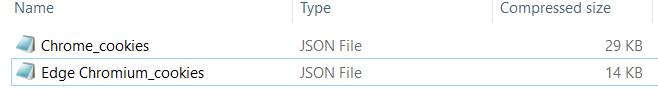

# 🤖 HitmanPro.Alert Credential Theft Protection Bypass

## Introduction

For the past few months, I have been revamping some old credential stealer I made a few years ago, I like to develop tools like this since it gives me a better understanding of how they work.

When testing malware I normally install a bunch of antivirus softwares in a VM and check which ones are triggered. While most of the antivirus detected nothing, I couldn't get past [HitmanPro.Alert](https://www.hitmanpro.com/)

<figure><figcaption></figcaption></figure>

## Chromium's Credential Storage Mechanism

Browsers based on Chromium, such as Chrome, Edge, Opera, and others, all use the same mechanism for storing credentials on disk. This includes saved login data and cookies.&#x20;

While most of the values are saved in plaintext, but passwords and cookie values are encrypted.&#x20;

The master key used to decrypt these values is also stored on the disk, within a file named "**Local State**".&#x20;

However, this master key is not stored openly, it's encrypted using the [CryptProtectData ](https://learn.microsoft.com/en-us/windows/win32/api/dpapi/nf-dpapi-cryptprotectdata)function. This specific method of encryption ensures that the master key can only be decrypted on the same machine and by the same user account that performed the encryption.

## How (I think) HitmanPro.Alert works

To understand what was getting detected by HitmanPro.Alert, I took the approach of running the malware line by line in the debugger.&#x20;

When doing this, I saw it was getting detected when I ran this specific line of code here:

<figure><figcaption></figcaption></figure>

`ProtectedData.Unprotect` This is a C# wrapper for the previously seen [CryptProtectData ](https://learn.microsoft.com/en-us/windows/win32/api/dpapi/nf-dpapi-cryptprotectdata)function.

When running this line of code, I again get the detection from HitmanPro

<figure><figcaption></figcaption></figure>

One interesting thing is, HitmanPro knows that the key I tried to decrypt was from Edge Browser

<figure><figcaption></figcaption></figure>

Although I do not know 100% how it works, I can assume it somehow stores the keys for all browsers, or most known browsers, and then if it detects one of these keys being decrypted, blocks it.&#x20;

So this gave me an idea, what happens If I manually change the key stored in the "**Local State**" file?

After I manually change the key (keeping a backup of the real one), when trying now to decrypt the real key, HitmanPro does not detect anything.&#x20;

Again, this can make us assume that it keeps track of modifications to the "**Local State**" file, and updates the key if It changes.

## Bypassing Credential Theft Protection

Having all this information now, we can bypass HitmanPro, so I added a bit of code and tried again:

<figure><figcaption></figcaption></figure>

<figure><figcaption></figcaption></figure>

The only new code here is the updating of the key value on disk before using the `ProtectedData.Unprotect` function and then setting it back to it's original value afterwards.

<figure><figcaption></figcaption></figure>

## Conclusion

The method we discovered to bypass HitmanPro.Alert "Credential Theft Protection" feature does not rely on exploits or unknown vulnerabilities. Instead, it's a simple tweak that challenges a well established security tool.

This experience teaches us that sometimes, cybersecurity isn't just about complex code or high-tech solutions. It's also about thinking creatively.
